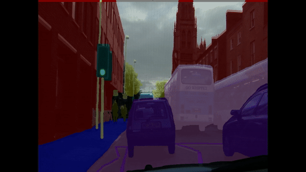

# camvid_semantic_segmentation_tf2

# Camvid_Semantic_Segmentatation_TF2
[](https://github.com/ptheywood/cuda-cmake-github-actions/actions?query=workflow%3AUbuntu)
[]()
[]()


> The goal of this project is to illustrate how easy it is to perform image segmentation today. With relatively little effort it is possible to achieve acceptable results. 
Here we use a FCN8 model with a pretrained VGG16 backbone. Due to the relatively complex nature of the problem (32 categories and only 369 training images) augmentation is also used. Therefore utilize the great Albumentation library (See. https://albumentations.ai/).
The code here should serve as template to help you get started with your own project.
However, in the near future, I will provide pretrained models for inference.



## Prerequisite
The code was tested on:

| OS        | Tensorflow           | Cuda Version  | Cuda Compilation Tools| Cudnn|
| ------------- |:-------------:|:-------------:|:-------------:|-----:|
| Ubuntu 18.04      | 2.5 | 11.2 | release 9.1, V9.1.85|  8.1.0|

### Download the camvid dataset:
You can download the dataset from:
```
     https://www.kaggle.com/carlolepelaars/camvid
```

### Download needed modules:
##### Albumentations augmentation library
```
        $ pip install albumentations
```
##### Tensorflow addons:
```
        $ pip install tensorflow-addons
```
## Brief:
The complete project is configured using the config.py file. 

Here, you can provide the respective dataset paths, define basic hyperparameters as well as define your optimizer,loss function and metrics. This means that for basic training an evaluation not a single line of code must be changed.

### Training:
In order to train the model you must make sure that the MODE FLAG in config file is set to = "training"
```python
MODE = "training" 
```
This will create a checkoint directory and store the weights inside. You can decide where to store the weight by setting SAVE_LOAD_WEIGHTS_PATH in the config.py. In my case it is set to: 
```python
SAVE_LOAD_WEIGHTS_PATH = '/home/anelmusic/anel_projects/camvid/camvid_semantic_segmentation_tf2/checkpoints/FCN8_SEGMENTATION_WEIGHTS'
```
## Hint:
Using the configuration provided in the config file you can expect aprox 60% accuracy. However, no advanced techniques (e.g learning rate scheduling) were used. 
Accuracy in this case may be misleading as the classes are severely imbalanced. In order to tackle this problem other metrics such as MeanIoU are suited.

## If you dont have a GPU:
I prepared a all-in-one Jupyter Notebook that can be run in google colab. You only need to create a google account and upload the dataset to your free google drive cloud storage.
Feel free to try: Camvid_All_in_one_Semantic_Segmentation.ipynb

## Meta

Anel Music– [@LinkedIn](https://www.linkedin.com/in/anelmusic/) – anel.music@web.de

Distributed under the MIT license. See ``LICENSE`` for more information.

[https://github.com/AnelMusic/](https://github.com/AnelMusic/)

## Contributing

1. Fork it (<https://github.com/AnelMusic/camvid_semantic_segmentation_tf2/fork>)
2. Create your feature branch (`git checkout -b feature/fooBar`)
3. Commit your changes (`git commit -am 'Add some fooBar'`)
4. Push to the branch (`git push origin feature/fooBar`)
5. Create a new Pull Request
